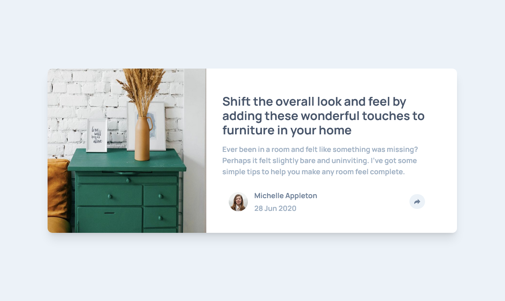

# Frontend Mentor - Article preview component solution

This is a solution to the [Article preview component challenge on Frontend Mentor](https://www.frontendmentor.io/challenges/article-preview-component-dYBN_pYFT).

## Table of contents

- [Overview](#overview)
  - [The challenge](#the-challenge)
  - [Screenshot](#screenshot)
  - [Links](#links)
- [My process](#my-process)
  - [Built with](#built-with)
  - [What I learned](#what-i-learned)
  - [Continued development](#continued-development)
  - [Useful resources](#useful-resources)
- [Author](#author)
- [Acknowledgments](#acknowledgments)

## Overview

### The challenge

Users should be able to:

- View the optimal layout for the component depending on their device's screen size
- See the social media share links when they click the share icon

### Screenshot



### Links

- Solution URL: [FrontendMentor.io](https://www.frontendmentor.io/solutions/article-preview-component-solution-RuVzCzgRh)
- Live Site URL: [Vercel](https://prj-02-article-preview-component.vercel.app/)

## My process

### Built with

- Semantic HTML5 markup
- CSS custom properties
- Flexbox
- CSS Grid
- Mobile-first workflow

### What I learned

In this project I learned how to change HTML attributes in Javascript. Doing that, I realized that ViteJS change the name of the images (assets) if they are not included in a Public folder (https://vitejs.dev/guide/assets.html#the-public-directory) so I was needed to put them in that folder in order to be able to reference that files in Javscript's set-attribute command.

```js
shareButtonSocial.addEventListener("click", (ev) => {
  if (bannerDisplayed) {
    shareBanner.classList.replace("flex", "hidden");
    bannerDisplayed = false;
    shareButtonCard.classList.replace(
      "bg-desaturatedDarkBlue",
      "bg-lightGrayishBlue"
    );
    shareButtonCardImg.setAttribute("src", "images/icon-share.svg");
  }
});

```
### Continued development

Future projects will be developed using TailwindCSS and vanilla Javascript when interactivity must be included.

### Useful resources

- [ViteJS Public Directory](https://vitejs.dev/guide/assets.html#the-public-directory)
- [TailwindCSS Directives](https://tailwindcss.com/docs/functions-and-directives) - Use of @apply directive
- [Customizing Colors in TailwindCSS](https://tailwindcss.com/docs/customizing-colors) - Adding personalized color names to be used in tailwindcss.
- [Customizing Fonts in TailwindCSS](https://tailwindcss.com/docs/font-family#using-custom-values) - Adding Google fonts to be used in tailwindcss.

## Author

- Website - [Gustavo Sanchez](https://www.gusanche.dev)
- Frontend Mentor - [@gusanchedev](https://www.frontendmentor.io/profile/gusanchedev)
- Github - [@gusanchedev](https://www.github.com/gusanchedev)
- Twitter - [@gusanchedev](https://www.twitter.com/gusanchedev)
- Linkedin - [gusanchedev](https://www.linkedin.com/in/gusanchedev/)

## Acknowledgments

Thanks to Mariapaz for being my friend and support 💙
